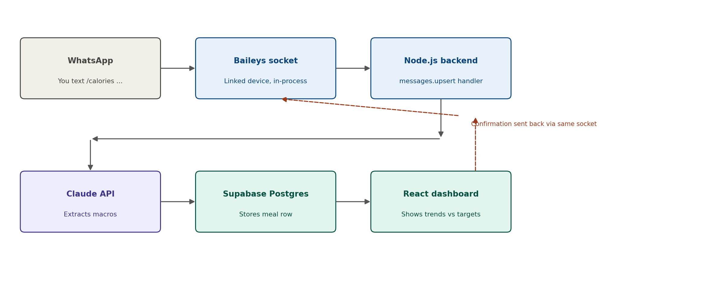

# PRD: WhatsApp Calorie & Macro Tracker

**Owner:** Ahmad
**Status:** Draft v6
**Last updated:** July 27, 2026

---

## 1. Main idea

A personal, fully automated food-logging system. Ahmad sends a WhatsApp message describing what he ate, prefixed with `/calories`. The message is picked up by **Baileys** — a library that links to his WhatsApp account as an additional device, the same way WhatsApp Web does — parsed by an LLM (via OpenRouter) into structured nutrition data, stored in Supabase, and confirmed back to Ahmad on WhatsApp — all within seconds and with zero manual data entry. A React dashboard visualizes daily and weekly intake against fixed targets.

## 2. Problem statement

Manually logging meals in a nutrition app is high-friction: opening an app, searching a food database, estimating portions, and entering values interrupts the moment and gets abandoned within days. Ahmad already has WhatsApp open constantly and prefers typing a short, natural description over navigating a dedicated app. There is no low-friction way today to turn a one-line text like "200g rice 50g beef lunch" into structured calorie/macro data without manual lookup.

## 3. User personas

Single persona — this is a personal-use tool, not a multi-tenant product.

**Ahmad — the user and the builder**
- CS student, backend engineer background, comfortable with the full stack involved.
- Wants to log meals in under 10 seconds, without leaving WhatsApp.
- Wants visibility into daily/weekly trends against personal targets, not a full nutrition-coaching experience.
- Tolerant of imperfect calorie estimates; not tolerant of friction or manual data entry.

## 4. Goals & success metrics

| Goal | Metric | Notes |
|---|---|---|
| Logging becomes a habit, not a chore | Logging consistency — number of days per week with at least one logged meal | Target: track weekly; aim to establish a daily habit. Exact day-count threshold TBD once real usage data exists. |
| Estimates are trustworthy enough to act on | Estimate accuracy — spot-check a sample of logged meals against manually verified values (known packaged foods, a kitchen scale) | No ground-truth database in v1; accuracy is validated by periodic manual spot-checks, not automated. |
| Logging stays effortless | Low friction — one WhatsApp message, no app switching, confirmation reply arrives within a few seconds | Success = Ahmad never feels the need to open a separate nutrition app instead. |

Out of scope for success metrics in v1: retention/engagement analytics, streaks, or any gamified metric (explicitly not wanted).

## 5. Scope (v1)

- Text-only meal logging via WhatsApp, triggered by the `/calories` prefix.
- **Baileys** as the WhatsApp connection layer — an unofficial library that links to Ahmad's existing WhatsApp account via the Linked Devices feature (no Twilio, no Meta Business verification, no per-message fees).
- Node.js backend hosting the Baileys socket and handling incoming message events directly (no external HTTP webhook involved).
- **`openai/gpt-oss-20b:free` via OpenRouter** (forced tool calling) extracting structured calories/macros from the message text — chosen to avoid Claude API's pay-as-you-go billing.
- Supabase (Postgres) as the data store.
- WhatsApp confirmation reply after each successful log, sent back through the same Baileys socket.
- React dashboard (Recharts) showing daily/weekly calorie and protein totals against hardcoded targets.
- Hardcoded daily targets: **3,000 kcal / 120g protein**.
- Timezone handled as a fixed offset (Asia/Dubai, UTC+4) at the application layer; all timestamps stored in UTC.

## 6. Out of scope (v1)

Explicitly deferred or excluded:

- **Voice message logging** — deferred; not built in v1.
- **Image-based food logging** — deferred to a later version.
- **Undo / correct-last-entry command** — deferred to v2.
- **Multi-user support** — this is a single-user tool; no auth system beyond filtering messages to Ahmad's own self-chat.
- **Streaks or gamification** — explicitly not wanted.
- **Editable targets via UI** — targets are hardcoded in backend config, not user-editable in v1.
- **Automated accuracy validation** — no nutrition-database cross-referencing in v1; the LLM's estimate is trusted as-is.
- **Official WhatsApp Business API / Meta Cloud API** — considered, but Baileys was chosen for v1 to avoid Meta Business verification overhead and any per-message costs. Migrating to the official Cloud API remains an option later if reliability requirements increase.

## 7. Application flow



1. Ahmad texts `/calories 200g rice 50g beef lunch` to his own WhatsApp self-chat.
2. Because Baileys is linked to his account as a device, the message arrives as a `messages.upsert` event inside the same Node.js process — no public-facing webhook URL is involved.
3. The backend filters the event (own self-chat only, prefix check), strips the `/calories` prefix, and sends the remaining text to OpenRouter.
4. The model returns structured nutrition data via forced tool calling.
5. The backend writes a new row to Supabase.
6. The backend sends a confirmation message back to Ahmad through the same Baileys socket (`sock.sendMessage`).
7. The React dashboard reads from Supabase independently and renders trends against the hardcoded targets.

## 8. Message handling (replaces the Twilio webhook design)

Because Baileys maintains a persistent WebSocket connection instead of receiving inbound HTTP calls, there is **no public `POST /calorie` endpoint** in this version — the "API" is an in-process event handler attached to the Baileys socket. This is the main architectural shift from the Twilio-based design.

```js
sock.ev.on('messages.upsert', async ({ messages }) => {
  for (const msg of messages) {
    await handleIncomingMessage(msg);
  }
});
```

### Incoming event shape (from Baileys)

| Field | Description |
|---|---|
| `key.remoteJid` | Chat identifier — for self-chat, this equals Ahmad's own JID |
| `key.fromMe` | `true` if Ahmad sent it (self-chat messages sent from his phone show as `true`) |
| `key.id` | Unique message ID — used for idempotency |
| `message.conversation` or `message.extendedTextMessage.text` | The message text, depending on how it was composed on the sending device |
| `messageTimestamp` | Unix timestamp from WhatsApp |

### Security / filtering checks (in order)

1. **Self-chat filter** — confirm `key.remoteJid` matches Ahmad's own JID and `key.fromMe === true`. Any message from another chat is ignored. This replaces Twilio's sender-allowlist check; there's no signature to validate since nothing is arriving over public HTTP.
2. **Idempotency check** — look up `key.id` against previously processed message IDs (unique constraint in Supabase) before processing, in case the event fires more than once.
3. **Command filter** — extract message text (`message.conversation ?? message.extendedTextMessage?.text`), check it starts with `/calories` (case-insensitive, trimmed). If not, ignore.

### Reply behavior

No separate outbound REST call is needed. After the LLM returns a result and the Supabase write succeeds, the backend replies directly on the same socket:

```js
await sock.sendMessage(msg.key.remoteJid, {
  text: `Logged: ${summary} — ~${calories} kcal, ${protein_g}g protein`
});
```

### Hosting implication

Baileys requires an **always-on process**, not a stateless serverless function — the socket connection must stay alive to keep receiving events. This isn't just a latency preference (as it was framed for the old Twilio webhook design) — it's now a hard requirement.

**Decision:** host on a **GCP "Always Free" e2-micro VM**, not a PaaS like Railway/Render/Fly.io. Those were the initial suggestion, but none of them offer a genuinely free tier suited to a persistent socket connection: Railway and Fly.io removed their free tiers entirely (roughly $5/month minimum), and Render's free tier spins services down after 15 minutes of inactivity, which would kill the WhatsApp connection. GCP's Always Free tier includes a small VM that runs indefinitely at zero cost with no sleep/spin-down behavior (originally planned for Oracle Cloud's equivalent Always Free VM; moved to GCP), at the cost of managing a real Linux server yourself instead of a git-push deploy flow.

## 9. LLM call structure (OpenRouter)

**Model decision:** `openai/gpt-oss-20b:free` via OpenRouter, replacing the originally-planned Claude Haiku integration. Reason for the switch: the Claude API is billed pay-as-you-go with no relation to any Claude.ai subscription, and OpenRouter's free tier eliminates that cost entirely for this low-volume use case (roughly 150-200 calls/month). Trade-off accepted knowingly: free open-weight models are less reliable at strict structured-output/tool-calling than Claude's forced `tool_choice`, so output should be validated (see Section 14, Phase 3) before trusting it unattended.

Single-turn, stateless call per meal, no conversation history sent — same shape as the original design, just a different provider and a different SDK (OpenRouter is OpenAI-compatible, so the `openai` npm package is used, pointed at OpenRouter's base URL, rather than the Anthropic SDK).

- **Endpoint:** `https://openrouter.ai/api/v1/chat/completions`
- **Model:** `openai/gpt-oss-20b:free` (full slug required — a bare model name without the provider prefix risks the request being misrouted, as happened when testing Gemma directly against Google's endpoint)
- **Output:** enforced via forced tool calling (`tool_choice` set to force the `log_meal` function) rather than prose JSON instructions
- **Messages:** a system message (role + task) followed by one `user` message containing the stripped meal text

```js
import OpenAI from "openai";

const openrouter = new OpenAI({
  apiKey: process.env.OPENROUTER_API_KEY,
  baseURL: "https://openrouter.ai/api/v1"
});

const response = await openrouter.chat.completions.create({
  model: "openai/gpt-oss-20b:free",
  messages: [
    {
      role: "system",
      content: "You are a nutrition estimator. Given a short meal description, estimate calories and macros for the food described."
    },
    { role: "user", content: mealText }
  ],
  tools: [
    {
      type: "function",
      function: {
        name: "log_meal",
        description: "Log a structured nutrition estimate for a described meal.",
        parameters: {
          type: "object",
          properties: {
            food_items: {
              type: "array",
              items: {
                type: "object",
                properties: {
                  name: { type: "string" },
                  quantity: { type: "number" },
                  unit: { type: "string" }
                },
                required: ["name", "quantity", "unit"]
              }
            },
            calories: { type: "number" },
            protein_g: { type: "number" },
            carbs_g: { type: "number" },
            fat_g: { type: "number" },
            confidence: { type: "string", enum: ["high", "medium", "low"] }
          },
          required: ["food_items", "calories", "protein_g", "carbs_g", "fat_g", "confidence"]
        }
      }
    }
  ],
  tool_choice: { type: "function", function: { name: "log_meal" } }
});

const args = JSON.parse(response.choices[0].message.tool_calls[0].function.arguments);
```

Note: no `cache_control`/prompt-caching setup here — that was specific to the Anthropic API. OpenRouter/free-tier models don't offer the equivalent, but at this call volume the cost/latency benefit was marginal anyway.

### JSON structure the backend receives (parsed from `tool_calls[0].function.arguments`)

```json
{
  "food_items": [
    { "name": "rice", "quantity": 200, "unit": "g" },
    { "name": "beef", "quantity": 50, "unit": "g" }
  ],
  "calories": 480,
  "protein_g": 22,
  "carbs_g": 65,
  "fat_g": 12,
  "confidence": "medium"
}
```

The backend maps this directly onto a `meals` row insert.

## 10. Data model (Supabase / Postgres)

**`meals`**

| Column | Type | Notes |
|---|---|---|
| `id` | uuid, PK | |
| `whatsapp_message_id` | text, unique | Baileys `key.id` — idempotency key |
| `raw_message_text` | text | Original text after prefix strip |
| `food_items` | jsonb | As returned by the LLM |
| `calories` | numeric | |
| `protein_g` | numeric | |
| `carbs_g` | numeric | |
| `fat_g` | numeric | |
| `confidence` | text | `high` / `medium` / `low` |
| `logged_at` | timestamptz | Set on receipt, stored in UTC |
| `created_at` | timestamptz | Default `now()` |

No `users` table in v1 — single-user, so `user_id` is unnecessary until multi-user is in scope.

### Hardcoded targets (backend config)

```js
const TARGETS = {
  calories: 3000,
  protein_g: 120
};
```

Carbs/fat targets not defined — no numbers provided for v1; dashboard shows carbs/fat as informational only, not compared against a target.

## 11. Project file structure

A single monorepo, since both halves are small and personal, but cleanly separated so the backend (runs on the GCP VM) and dashboard (deploys to Vercel) don't get tangled. Dashboard uses Next.js App Router conventions.

```
whatsapp-calorie-tracker/
├── backend/
│   ├── src/
│   │   ├── index.js                 # entry point — starts the Baileys socket, wires up the event handler
│   │   ├── whatsapp/
│   │   │   ├── socket.js            # makeWASocket setup, auth state, connection.update handling
│   │   │   └── messageHandler.js    # self-chat filter, idempotency check, /calories prefix parsing
│   │   ├── llm/
│   │   │   ├── client.js            # OpenAI SDK init, pointed at OpenRouter's base URL
│   │   │   ├── logMealTool.js       # the log_meal tool schema (Section 9)
│   │   │   └── extractMeal.js       # calls OpenRouter with forced tool calling
│   │   ├── db/
│   │   │   ├── supabaseClient.js
│   │   │   └── meals.js             # insert row, idempotency lookup by whatsapp_message_id
│   │   ├── config/
│   │   │   └── targets.js           # hardcoded TARGETS (3000 kcal / 120g protein)
│   │   └── utils/
│   │       └── logger.js            # structured pino logs
│   ├── auth_session/                # Baileys credentials — gitignored, treated as a secret
│   ├── .env.example
│   ├── Dockerfile                   # single-stage, node:25-slim — no build step, Node strips TS at runtime
│   ├── docker-compose.yml           # restart: unless-stopped + auth_session/ bind mount
│   ├── .dockerignore
│   └── package.json
│
├── dashboard/
│   ├── app/
│   │   ├── layout.jsx               # root layout, wraps all pages
│   │   ├── page.jsx                 # main dashboard page (server or client component)
│   │   └── globals.css
│   ├── components/
│   │   ├── DailySummary.jsx
│   │   ├── WeeklyTrendChart.jsx     # Recharts line/bar chart, "use client"
│   │   ├── MacroBreakdown.jsx       # protein/carbs/fat split, "use client"
│   │   └── TargetProgress.jsx       # actuals vs hardcoded targets
│   ├── hooks/
│   │   └── useMeals.js              # client-side fetch from Supabase, shapes data for charts
│   ├── lib/
│   │   └── supabaseClient.js        # reads NEXT_PUBLIC_SUPABASE_URL / ANON_KEY
│   ├── config/
│   │   └── targets.js               # mirrors backend/src/config/targets.js
│   ├── public/
│   ├── .env.local.example
│   ├── next.config.js
│   └── package.json
│
├── supabase/
│   └── schema.sql                   # meals table DDL, matches Section 10
│
├── docs/
│   └── PRD_whatsapp_calorie_tracker.md
│
├── .github/
│   └── workflows/
│       └── backend-cd.yml           # typechecks, then SSHes into the GCP VM and redeploys via docker compose
│
├── .gitignore                       # auth_session/, .env, .env.local, node_modules, .next
└── README.md
```

Notes:
- No `routes/`/`controllers/` folder in `backend/` — there's deliberately no HTTP layer for incoming messages, since Baileys pushes events directly (Section 8). A `http/` folder is only worth adding later if a health-check endpoint gets introduced.
- `targets.js` is duplicated in both `backend/` and `dashboard/` rather than shared via a package — small enough to not warrant a shared workspace for a two-folder personal project, but worth flagging if the numbers ever drift out of sync.
- `auth_session/` lives inside `backend/` but is gitignored — it's the Baileys session credential (Section 12's security note), not code, and should never end up in version control.
- Env vars consumed client-side in the dashboard need the `NEXT_PUBLIC_` prefix (Next.js convention) — e.g. `NEXT_PUBLIC_SUPABASE_URL`, `NEXT_PUBLIC_SUPABASE_ANON_KEY`.
- Components using `useState`/`useEffect` (charts, anything interactive) need a `"use client"` directive at the top, since Next.js App Router defaults to Server Components.

## 12. Getting started with Baileys

1. **Install** (Node 17+ required):
   ```bash
   npm install baileys
   ```

2. **Create the socket and handle pairing.** On first run, Baileys needs a QR code scanned from the phone (WhatsApp → Settings → Linked Devices → Link a Device):
   ```js
   const { default: makeWASocket, useMultiFileAuthState } = require('baileys');
   const qrcode = require('qrcode-terminal');

   async function start() {
     const { state, saveCreds } = await useMultiFileAuthState('./auth_session');
     const sock = makeWASocket({ auth: state });

     sock.ev.on('creds.update', saveCreds);

     sock.ev.on('connection.update', (update) => {
       const { qr, connection } = update;
       if (qr) qrcode.generate(qr, { small: true });
       if (connection === 'open') console.log('Connected to WhatsApp');
     });

     sock.ev.on('messages.upsert', async ({ messages }) => {
       for (const msg of messages) {
         await handleIncomingMessage(msg, sock);
       }
     });
   }

   start();
   ```

3. **Scan the QR code** printed in the terminal with the phone's WhatsApp app. This links the Node process as a device on Ahmad's account — no third-party signup, no OTP.

4. **Persist the auth session.** `useMultiFileAuthState` writes session credentials to a local folder (`./auth_session` above) so the process doesn't need re-pairing on every restart. The Baileys docs flag this specific helper as demo-only and not production-safe — for anything longer-lived, session state should be persisted somewhere durable (e.g., encrypted and stored in Supabase or a mounted volume on the host), since losing it means re-scanning the QR code and, more importantly, treating that saved session data as a credential, not a log file — anyone with it can access the linked WhatsApp account.

5. **Deploy on a GCP Always Free e2-micro VM** (see Section 13) rather than a serverless or auto-sleeping platform, since the socket connection needs to persist. Make sure the auth-session storage survives reboots (it will, since it's a persistent VM, not an ephemeral container) — losing that folder forces a new QR scan.

6. **Filter and process messages** inside `handleIncomingMessage`, applying the self-chat filter, idempotency check, and `/calories` prefix check described in Section 8, then calling OpenRouter and writing to Supabase.

## 13. Getting started with GCP Always Free

GCP's Always Free tier includes one small Compute Engine instance that runs indefinitely at zero cost — no 30-day trial, no spin-down — in specific US regions (`us-central1`, `us-west1`, `us-east1`). The actual VM used for this project:

- **Machine type:** `e2-micro`
- **Boot disk:** Ubuntu 24.04 LTS (x86/64, amd64), 10GB, `pd-standard` (Balanced Persistent Disk)
- **Region/zone:** `us-central1-a`

1. **Create the VM.** Console → Compute Engine → VM instances → Create Instance, with the specs above. Confirm a public/external IP is assigned, and note it.

2. **Connect via SSH-in-browser** — the Console's "SSH" button opens a browser-based terminal directly against the VM. No local private key or `.pem` file to manage, unlike Oracle's setup.

3. **Clone the repo** (public, so no credential needed) and create the env file:
   ```bash
   git clone https://github.com/mohammad01ahmad/fitnessTracker.git
   cd fitnessTracker
   nano backend/.env   # OPENROUTER_API_KEY, SUPABASE_URL, SUPABASE_SERVICE_ROLE_KEY, SUPABASE_USER_ID
   ```

4. **Install Docker** — no system Node install needed at all, the container brings its own (see `backend/Dockerfile`, pinned to `node:25-slim`):
   ```bash
   curl -fsSL https://get.docker.com | sudo sh
   sudo usermod -aG docker $USER
   newgrp docker   # or log out/back in — group membership doesn't apply to an already-open session
   ```

5. **First run in the foreground**, so the QR code is visible to scan:
   ```bash
   cd ~/fitnessTracker/backend
   docker compose up --build
   ```
   Scan it from WhatsApp → Linked Devices → Link a Device. Wait for `"WhatsApp connection opened"` in the logs and confirm `auth_session/` now has files in it — that's the Baileys session persisting to the bind-mounted host directory.

6. **Switch to detached, persistent mode:**
   ```bash
   # Ctrl+C first, then:
   docker compose up -d
   ```
   `restart: unless-stopped` in `docker-compose.yml` means it survives VM reboots and crashes on its own — the same job `pm2 startup`/`pm2 save` would otherwise be doing.

7. **No inbound firewall rules needed.** Unlike a webhook-based design, this process only makes outbound connections (to WhatsApp, OpenRouter, and Supabase) — nothing needs to reach it from the internet, so GCP's default firewall rules don't need opening up.

8. **Set a budget alert** (Console → Billing → Budgets & alerts) so an email arrives if usage ever threatens to exceed Always Free limits — a safety net against surprise charges even though staying within Always Free resources should never trigger a bill.

9. **(Optional) automatic deploys.** `.github/workflows/backend-cd.yml` typechecks every push to `main` touching `backend/`, then SSHes in and runs `git fetch && git reset --hard && docker compose up -d --build` on the VM — set up once via three repo secrets (`DEPLOY_HOST`, `DEPLOY_USER`, `DEPLOY_SSH_KEY`).

### If the connection breaks

If the linked device gets removed on the WhatsApp side (e.g. the account itself was deleted or reset on the phone), the bot's own reconnect logic will **not** retry automatically — `socket.ts` deliberately checks for `DisconnectReason.loggedOut` and treats that as a permanent disconnect, not a transient one worth auto-retrying. Restoring it means a fresh pairing, same as the very first setup:

```bash
cd ~/fitnessTracker/backend
docker compose down
sudo rm -rf auth_session/*   # sudo needed — the container writes these files as root
docker compose up             # foreground again, to see + scan the new QR
# once auth_session/ is repopulated and "WhatsApp connection opened" appears,
# Ctrl+C, then:
docker compose up -d
```

## 14. Build plan

Ordered the way this actually gets built: data layer and core logic first (so each piece is verifiable in isolation), then integration, then infrastructure, then the dashboard last, since it's more useful to build against real logged data than fixtures.

### Phase 1 — Project scaffolding
1. Initialize the Node.js repo, folder structure, `.env` handling, and git.
2. Install core dependencies: `baileys`, `openai` (used against OpenRouter's base URL), `@supabase/supabase-js`.

### Phase 2 — Data layer
3. Create the Supabase project and the `meals` table per Section 10's schema.
4. Grab the Supabase URL and service role key; confirm a test row can be written and read from a throwaway script.

### Phase 3 — Core logic in isolation (no WhatsApp yet)
5. Write the OpenRouter integration as a standalone script: hardcode a sample meal string, call the API with the `log_meal` tool schema and forced tool calling, print the structured JSON output.
6. Iterate on the system prompt/tool schema against a handful of test inputs (different phrasing, multiple items, vague quantities) until output looks reliable.
7. Wire that script to insert its output into the `meals` table — confirm a full "text in → structured row in DB" path works with zero WhatsApp involvement.

*Rationale: this is the riskiest, most novel part of the app (extraction accuracy, plus free-model reliability). Validating it against plain text first keeps bugs here separate from WhatsApp connection issues later.*

### Phase 4 — WhatsApp connection, locally
8. Set up Baileys locally, pair via QR code against Ahmad's own account, confirm `messages.upsert` events fire when messaging himself.
9. Build the self-chat filter, idempotency check, and `/calories` prefix parser — log the parsed meal text to confirm filtering logic before touching OpenRouter or Supabase.

### Phase 5 — Full pipeline, locally
10. Connect Phase 3's OpenRouter+Supabase logic into Phase 4's message handler: real `/calories` message → OpenRouter → Supabase insert → confirmation reply via `sock.sendMessage`.
11. Hardcode the targets config (3,000 kcal / 120g protein) — not consumed yet, but the constant should exist before the dashboard needs it.
12. Run end-to-end locally with real messages for a day or two before deploying anywhere, so bugs surface while it's still easy to restart and debug on-machine.

### Phase 6 — Infrastructure
13. Set up the GCP Always Free e2-micro VM (instance, SSH-in-browser) per Section 13.
14. Install Docker on the VM; clone the repo; create `backend/.env`.
15. Re-pair Baileys on the server (fresh QR scan — the local session doesn't transfer) via `docker compose up --build` in the foreground; verify messages flow through the deployed version.
16. Switch to `docker compose up -d` (its `restart: unless-stopped` policy survives reboots and crashes on its own); set the GCP budget alert.

*Rationale for deploying at this point, not earlier: no reason to provision and manage a server before the thing running on it actually works.*

### Phase 7 — Dashboard
17. Scaffold the React app; connect `@supabase/supabase-js` to read from the `meals` table.
18. Build daily/weekly views with Recharts, plotting actuals against the hardcoded targets.
19. Deploy the dashboard (Vercel).

### Phase 8 — Live use and hardening
20. Use it for real for a stretch of days; watch for parsing mistakes, missed messages, or crashes.
21. Spot-check a handful of logged meals against known values to sanity-check the LLM's estimates (ties back to the estimate-accuracy success metric in Section 4) — extra weight here given the free-model reliability trade-off.
22. Add basic error visibility (structured pino logs, or a lightweight crash alert) so silent failures don't go unnoticed.

## 15. Open items for v2 (not in this PRD's scope)

- Voice message logging (transcription pipeline)
- Image-based food logging
- Undo / correct-last-entry command
- Editable targets via dashboard UI
- Multi-user support
- Re-evaluate migration to the official Meta Cloud API if Baileys' unofficial status becomes a reliability concern
